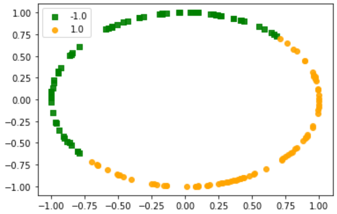
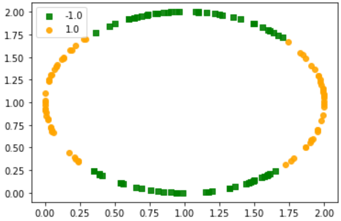

# Machine Learning Assignment 3 and 4:

By:
[@kggold4](https://www.github.com/kggold4)
[@TalSomech](https://www.github.com/TalSomech)

## <i>Assignment 3:</i>

> Perceptron & AdaBoost algorithms implementation

### <i>This assignment has two main parts:</i>

> Part 1 - Implement Perceptron:

For this question see the notebook: [perceptron.ipynb](machine-learning-ex3/perceptron.ipynb).

By given the [two_circles](https://github.com/kggold4/machine-learning-ex3/blob/main/machine-learning-ex3/data/two_circle.txt) of 150 points, we built a ```perceptron``` model that classified this data into two different group:



<br><br>

> Part 2 - Implement AdaBoost Algorithm:

For this question see the notebook: [adaboost.ipynb](machine-learning-ex3/adaboost.ipynb).

By given the [four_circle](https://github.com/kggold4/machine-learning-ex3/blob/main/machine-learning-ex3/data/four_circle.txt) of 150 points, we built an ```adaboost``` model that classified this data into four different group:



<br><br>

See instructions for this assignment in [PDF](https://github.com/kggold4/machine-learning-ex3/blob/main/machine-learning-ex3/hw3%202022.pdf)

* See the [util_functions](machine-learning-ex3/util_functions.py) file to see addition helping functions and classes for there assignment.


## <i>Assignment 4:</i>

> KNN algorithms implementation

For this question see the notebook: [knn.ipynb](machine-learning-ex4/knn.ipynb).

```# TODO - complete here introduction summary of assignment 4```

See instructions for this assignment in [PDF](https://github.com/kggold4/machine-learning-ex3/blob/main/machine-learning-ex4/hw4%202022.pdf)
